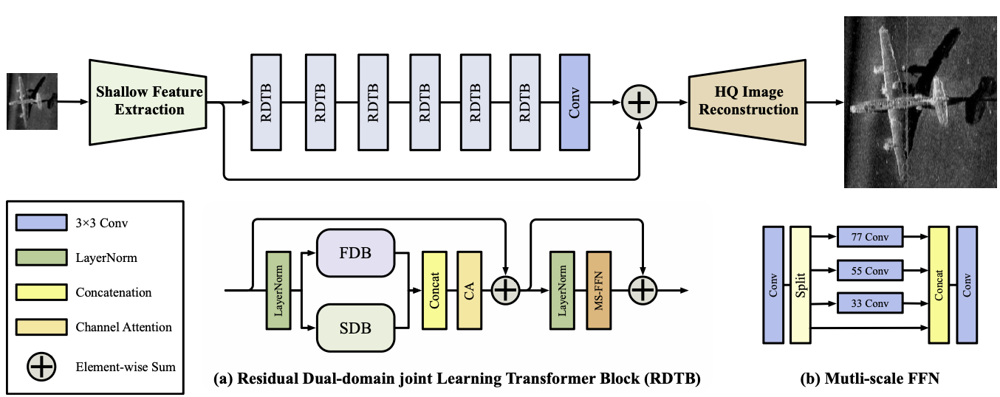

# FLT

[An Attempt at Underwater Image Lightweight Super-Resolution Using Transformer and Frequency-Domain Learning](https://github.com/WanghtCC/FLT?tab=readme-ov-file)

- Apr. 08, 2026: This paper is being reviewed on the *Frontiers in Marine Science*.

---

#### **Abstract**

###### Lightweight image Super-resolution (SR) is a computer vision technology that aims to recover high-quality image details from low-resolution images with limited computing costs. While Transformer-based SR models have made remarkable advancements, their balanced edge-end deployment and reconstruction quality have been notably hindered by complex underwater imaging conditions and the scarcity of publicly available high-quality datasets. To address these issues, we propose a Frequency-domain Learning Transformer (FLT) for underwater images SR, which leverages complementary information from spatial and frequency domains to enable fine-grained detail reconstruction while reducing storage and computing costs. Specifically, FLT comprises Residual Dual-domain Joint Learning Transformer Blocks (RDTBs). Each RDTB captures low-frequency structures via the spatial-domain branch and high-frequency textures via the frequency-domain branch, thereby enhancing fine-grained details of lightweight SR. Furthermore, a Multi-scale FeedForward Neural (Ms-FFN) network is incorporated into each RDTB as an auxiliary detail enhancement module, which improves the visual fidelity of reconstructed images through multi-scale feature aggregation. We perform visual and quantitative comparisons, ablation studies, and model analyses against state-of-the-art methods on both the public UFO-120 dataset and the KLSG-II dataset. Experimental results demonstrate that FLT achieves performance comparable to or exceeding state-of-the-art SR models, while having significantly reduced by about 50% to 60% parameters and drastically reduced computational cost. This unique balance between reconstruction quality and efficiency underscores FLT’s superiority for lightweight underwater SR, providing a promising solution for resource-constrained underwater imaging applications.



## Contents

1. [Dataset](#Dataset)
2. [Training](#Training)
3. [Testing](#Testing)

## Dataset

We used two open source datasets to train our model as follow:

- [**UFO-120**](http://irvlab.cs.umn.edu/resources/ufo-120-dataset). 
- SeabedObjects-KLSG-II

Used datasets can be downloaded as follows:

- [UFO120](https://pan.baidu.com/s/1Fnf7e5RkbKNsN5MeABdEog)
- [SeabedObjects-KLSG--II](https://pan.baidu.com/s/1RmhYDmzcs2JFwg3uXBK76g?pwd=g5fr)

The code and datasets need satisfy the following structures:

```
├── FLT	# Train / Test Code
├── data	# all data contents for this code
|  └── datasets	# all datasets for this code
|  |  └── UFO120	# UFO dataset  	
|  |  |  └── TEST	# Test datasets
|  |  |  └── train_val	# Training datasets
|  |  └── SeabedObjects-KLSG--II	
|  |  |  └── plane
|  |  |  └── seafloor
|  |  |  └── ship
 ─────────────────
```

Since the KLSG dataset does not have a unified preprocessing standard, it needs to be processed by itself. **The script has been included in the dataloader**.

The divided KLSG dataset can be downloaded [here](https://pan.baidu.com/s/1-X9Ya7i9V05bmgzSR6MCtg?pwd=2vg6).

## Training

We have prepared the training results of FLT on both datasets, which can be downloaded [Here](https://github.com/WanghtCC/FLT/releases/tag/model_weight).

- Use the below command to train on UFO120:

```
python main_ufo.py -opt options/train_sr_ufo.json           
```

- Use the below command to train on KLSG:

```
python main_klsg.py -opt options/train_sr_klsg.json
```

## Testing

- Use the below command for testing:

```
python test.py -opt options/train_sr_ufo.json
python calc_metrics.py
```

### Send us feedback

If you have any queries or feedback, please contact us @(wang.h.t@outlook.com).

## Citation

It will be opened upon acceptance.

## License and Acknowledgement

This project is released under the Apache 2.0 license. The codes are based on [BasicSR](https://github.com/xinntao/BasicSR) and [KAIR/SwinIR](https://github.com/cszn/KAIR). Please also follow their licenses. Thanks for their awesome works.
